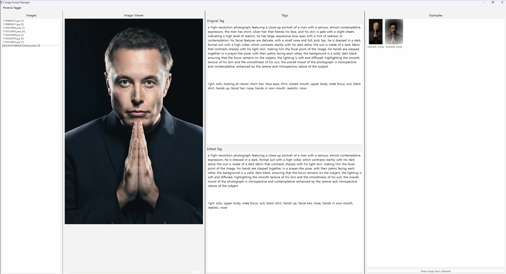

# Image Prompt Manager

A PySide6-based GUI tool for managing images, tags, and generated examples with Florence-2 PromptGen integration.



## Features

- Manage images and related data in organized folders
- Display images with scroll and zoom (Ctrl + mouse wheel)
- Edit and save original/edited tags
- View and paste generated example images
- Run Florence2 tagger for missing tags
- Adjustable layout with QSplitter

## Folder Structure

```
root/
 ├── images/
 │    ├── image1.jpg
 │    └── ...
 ├── image_data/
 │    ├── image1/
 │    │    ├── tags_original.txt
 │    │    ├── tags_edited.txt
 │    │    ├── example_1.png
 │    │    └── ...
 │    └── ...
```

## Installation
git clone https://github.com/hvppycoding/imagepromptmanager.git
cd imagepromptmanager
pip install -r requirements.txt

## Run
python image_prompt_manager.py

## Requirements
- Python 3.10+
- PySide6
- transformers
- torch
- pillow